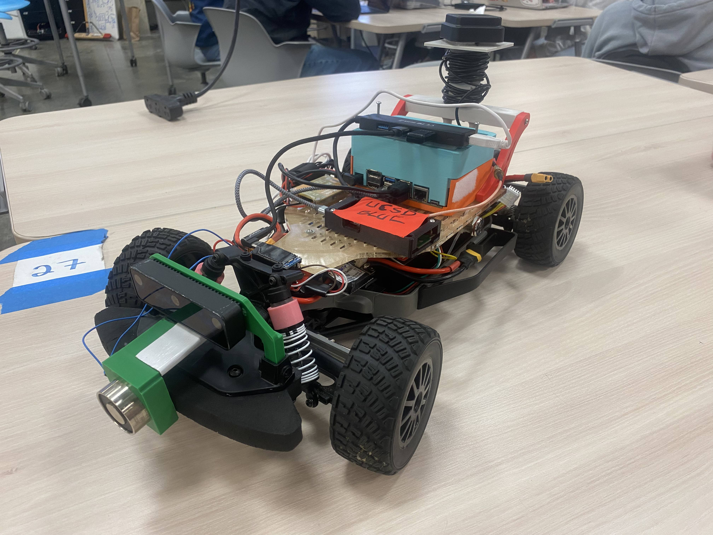
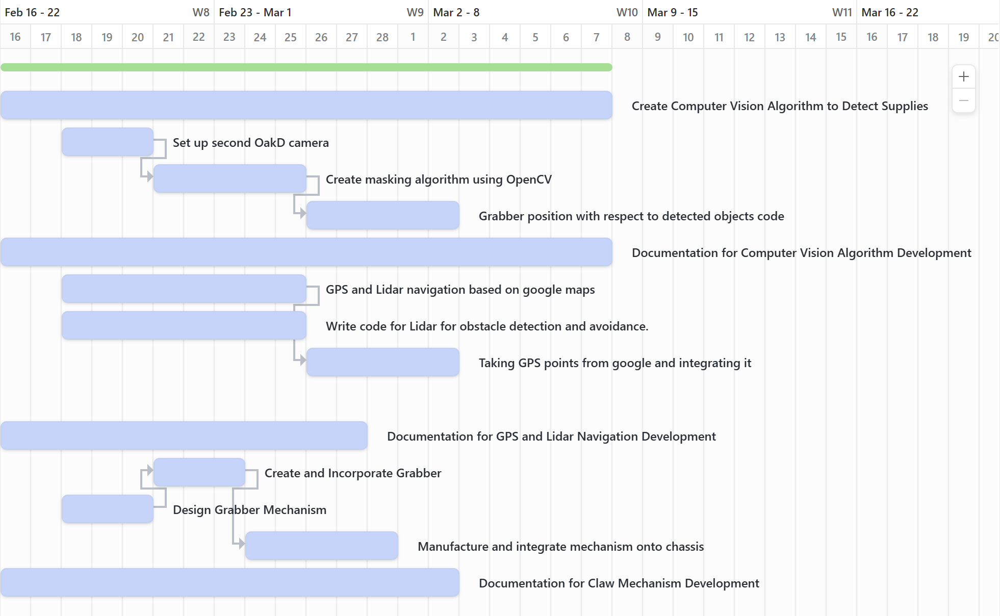

# 
Autonomous Stock Relief

### 
 MAE 148 Final Project 

#### 
 Team 3 Winter 2025 

  

## Table of Contents
  <ol>
    <li><a href="#team-members">Team Members</a></li>
    <li><a href="#abstract">Abstract</a></li>
    <li><a href="#what-we-promised">Promises and Stretch Goals</a></li>
    <li><a href="#accomplishments">Accomplishments</a></li>
    <li><a href="#challenges">Challenges</a></li>
    <li><a href="#Potential-Improvements">Potential Improvements</a></li>
    <li><a href="#Demonstrations">Demonstrations</a></li>
    <li><a href="#Robot-Design">Robot Design</a></li>
      <ul>
        <li><a href="#Mechanical-Designs">Mechanical Designs</a></li>
        <li><a href="#Electrical-System-Diagram">Electrical System Diagram</a></li>
      </ul>
  </ol>

## Team Members
Anton John Del Mar - ECE ML & Controls - Class of 2025

Tigran Grigoryan - MAE Controls & Robotics - Class of 2027

Kanishk Mehta - MAE Aerospace - Class of 2026

Juan Sanchez - MAE Aerospace - Class of 2026

## Abstract
The goal of our project was to create a bot that would be able to navigate between different warehouses and transport supply from overflowing warehouses to one's with less stock. To navigate between the warehouses the idea was the employ GNSS and once inside the warehouse, the bot would utilize a model running on the OAK-D Lite in order to identify boxes and pick them up with a grabbing mechanism in order to transport.

## Promises and Stretch Goals
Promised
* Integrate GNSS, OAK-D model, and Grabber Mechanism into the ROS2 system.

Stretch Goals
* Create a "A*" algorithm in order to find the shortest distance between two warehouses and take that route.
* Integrate lidar into ROS2 system in an effort for obstacle avoidance, following a global path until reaching an obstacle and using lidar to follow a local path avoiding the obstacle and getting back onto the global path.

## Accomplishments
- Created and integrated custom electromagnet grabber mechanism.
- Developed April Tag detection algorithm for autonomous loading of supplies.
  - Integrated our own custom PID control to self-align towards boxes with April Tags.
- Created custom GPS algorithm for autonomous navigation to warehouse points.
  - Also used custom PID control along with cross track error algorithm to stay on path.
  - Used .csv files and parsed them for GPS coordinates

## Challenges
- Our electronics mount broke during the race, causing us to have to redesign a base and reintegrate our electronics.
- We initially made our own electromagnet, however could not integrate it with the relay circuit, causing us to have to use a store bought one.
- The first camera mount we created was too high and since it was adujustable the angle could change and require us to recallibrate our April Tag detection. We thus created a new short, fixed camera mount that also could hold our electromagnet.
- It took one week to debug and get our GPS to work. We tried two different repositories for the PointOneNav, tried different Docker containers, tried uninstalling and reinstalling the fusion-engine-driver, we tried other GPS modules, we even tried to use the Ublox, all to no avail. After one week of trieless debugging and suffering, it turns out it really was just our module. Our module simply did not work with the fusion-engine-driver in ROS2, but our TA Winston had a module that did and he let us use his.
- A lot of restless coding, debugging, and testing, trying to integrate our autonomous system fully in ROS2. 
- Issues with our Docker container caused us to lose some code and have to rewrite it.
- Jetson SD card was corrupted the day before our final presentation, and we could not save our Docker conatiner. Causing us to have to reflash our SD card, reinstall and setup everything such as pulling and setting up the Docker image, and also having to rewrite a lot of missing code.
- Created our own topic and message interface for our GPS and April Tag nodes, but then our VESC stopped working, preventing us from testing the interface.

## Potential Improvements
- Create a new camera mount such that the camera is a bit farther back, because since the camera was in the front it could not see the April Tag if it was too close.
- Design a different electromagnet grabber, our design required the boxes to be on a little pallet. Maybe have the electromagnet pick up boxes from above like a crane.
- Integrate a better circuit design using perf boards or even a PCB rather than just connecting everything with wires and electrical tape. 
- Complete testing the custom topic and interface to fully integrate the April Tag and GPS nodes. 

## Progress Videos

### Electromagnet Testing
**Description:**  
Demonstration of our custom electromagnet, and later the Arduino relay circuit with a store bought electromagnet communicating via SPI to the Jetson.

### April Tag Testing
**Description:**  
Initial April Tag detection algorithm, April Tag detection without PID tuning, and finally April Tag detection with PID tuning as well as a POV shot of what the robot sees during self-alignment.

### GPS Testing
**Description:**  
Initial GPS testing without PID tuning.

## Final Demonstrations

### April Tag Detection and GPS Navigation
**Description:**  
Sucessfull autonomous loading of supply with April Tag Detection using PID tuning. Succesfull autonomous navigation to a warehouse point 'A' using GPS and PID tuning as well.

## Robot Design

### Mechanical Designs
| Part | CAD Model |
|------|--------------|
| Electronics Mounting Plate |  [🔗 CAD File](CAD%20Files/New%20Chassis/Electronics%20plate%20v13.f3d) |
| Camera Mount |  [🔗 CAD File](CAD%20Files/New%20Chassis/Camera%20Mount/Camera%20Mount%20assembly%20v5.f3z) |
| GPS Mount |  [🔗 CAD File](CAD%20Files/New%20Chassis/Gps%20mount%20v2.f3d) |
| Hinge Arm |  [🔗 CAD File](CAD%20Files/New%20Chassis/Hinge%20arm%20v8.f3d) |
| Hinge and GPS stand |  [🔗 CAD File](CAD%20Files/New%20Chassis/GPS+hinge%20stand%20v8.f3d) |
| Magnetic Lock |  [🔗 CAD File](CAD%20Files/New%20Chassis/Magnetic%20Lock%20v7.f3d) |
| Jetson Case Top |  [🔗 CAD File](CAD%20Files/New%20Chassis/Jetson%20Top%20V1.SLDPRT) |
| Jetson Case Bottom |  [🔗 CAD File](CAD%20Files/New%20Chassis/Jetson%20Bottom%20V1.SLDPRT) |
| Camera and ElectroMagnet Stand |  [🔗 CAD File](CAD%20Files/New%20Chassis/Camera%20and%20EM%20Stand.SLDPRT) |
| New Chassis Assembly |  [🔗 CAD File](CAD%20Files/New%20Chassis/Assemply%20v7.f3z) |

### Electrical System Diagram
| Comprehensive Wiring Diagram |
|------|
|  |

## Software Design 
### Overview 
Our project was completed using ROS2 through the djnighti/ucsd_robocar container, also utilizing libraries such as DepthAI AprilTag and pymap3d. With the use of ROS2 we were able to have free reign over our code allowing for full control and custom development of our autonomous system.

### Code Explanations 
april_tag_detector.py, car_control.py, PID.py
- april_tag_detector.py: We succesfully utilized ROS2 and DepthAI's April Tag library in order to allow our OAK-D camera to detect April Tags. We calculate how far the April Tag is and how off-center it is as well to determine how much to turn and drive.
  - Created a custom circuit that used an Arduino Pro Micro to control a relay to turn on and off our electromagnet, then used Python's serial library to allow our Jetson to interface with the circuit and turn on the electromagnet when needed. 
- car_control.py: we use the /drive topic with ackermann_msgs/msg/AckermannDriveStamped interface message type to control speed and steering angle of the bot.
- PID.py: With initial testing we found our robot would turn too much in proportion to the error. We created a PID class to help fine tune our robots self-alignment with April Tags.

gps_navigation.py, coordinates.csv
- gps_navigation.py: We succesfully utilized the PointOneNav GNSS in ROS2 order to get global positions and navigate between warehouses. Using Python's pymap3d library we can convert global coordinates into relative coordinates. For navigation we use pandas library to read a .csv file tellings us the origin and the coordinate of a warehouse, then simply use y = mx + b to determine the path by creating a straight line to the warehouse. We can now use cross track error and the determinant of two vectors to see how we deviate from the line and see which side we are on, and then use our PID class to realign ourselves onto the path.
- coordinates.csv: Holds the coordinates for the warehouse and origin.

final_project.launch.py, gps_april_msgs
- final_project.launch.py: Created a launch file that would launch our april_tag_detector.py and gps_navigation.py nodes, as well as the ucsd_robocar_nav2_pkg all_nodes.launch.py that would launch the vesc node.
- gps_april_msgs: Created a custom message interface called gps_april_msgs/msg/GpsApril along with a new topic named /GpsApril to allow the April Tag and GPS nodes to talk to eachother. This interface contained important information like if the robot was in approach mode or origin mode to tell it if it needs to drive to a warehouse or return to an origin, the warehouse name it needs to go to, as well as GPS mode and April Tag mode to well it when to run April Tag detection or GPS navigation.

### Implementation
If you wish to implement our code into your own project it is really simple! You can use the same container as you did for the OpenCV laps as we used the djnighti image with ROS2 for this one. All of our code was completed inside the ucsd_robocar_nav2_pkg, so simply add the code into this package. Make sure you add the executables in setup.py and if you rename them make sure to modify the launch file as well. If you want to create your own topic or interface you have to create a new package in ucsd_robocar_hub2, where all the packages are stored, in this case you can simply copy our folder as it has set up all the Cmake files already, you simply would just have to change the names to whatever you want. That is about it, have fun and goodluck!

## Gantt Chart

  

## Course Deliverables
Here are all the team assignments we had to complete for the course.
- [Autonomous Laps](https://youtube.com/shorts/bM4KuNR4FdE?si=LPRqq_h8zV2o7q9d)
- [GPS Laps](https://youtu.be/LaXMkxYxspk)
- [OpenCV Laps](https://youtu.be/_cmjnNDHkDQ?si=lZVS0dAk0vt-fLF-)
- [Progress Update Slides](https://docs.google.com/presentation/d/1vnkvjQhTCcCYGIWP700G1c7TLgcMM7nZI48wmxLYrfw/edit?usp=sharing)
- [Final Presentation Slides](https://docs.google.com/presentation/d/1t6mhh3AGAhgKwmr5gQEw1CEoPPurwSvcvcnYaqPXGoU/edit?usp=sharing)

